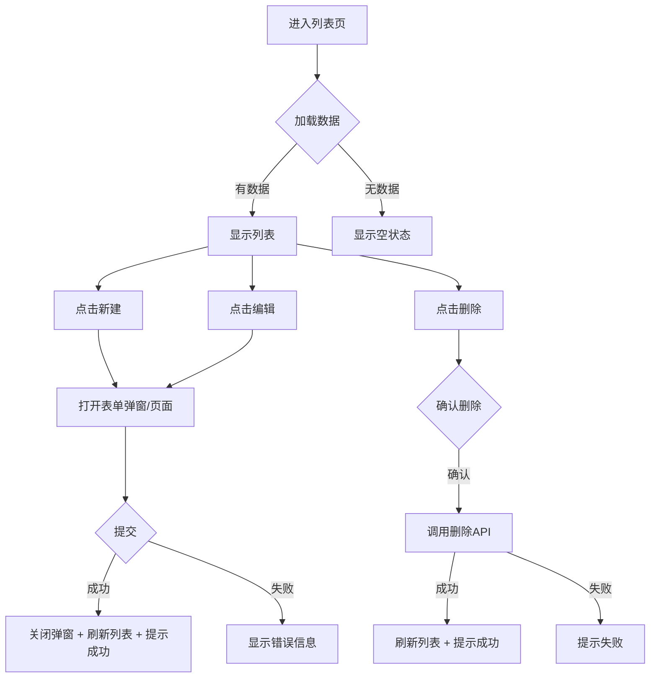

# Web 设计流程 (Web Design)

## 1. 概述

本技能定义了 Express4 项目中 Web 前端界面的标准化设计流程，从需求分析到交互原型，确保页面设计的一致性和专业性。设计过程遵循 `rules/visual-spec.md` 中定义的视觉设计规格。

---

## 2. 适用场景

- 设计新的管理后台页面
- 重构现有页面的 UI/UX
- 创建表单、列表、详情等通用页面模式
- 响应式布局设计

---

## 3. 设计流程

### 步骤 1：需求分析 (Requirements Analysis)

#### 1.1 页面目的
```markdown
## 页面设计需求

**页面名称**: [页面名称]
**页面类型**: [列表页 / 表单页 / 详情页 / 仪表盘 / 登录页 / 其他]
**目标用户**: [谁使用这个页面]
**核心任务**: [用户在这个页面上要完成什么任务]
**前置页面**: [用户从哪个页面来到此页]
**后续页面**: [用户操作后会去哪个页面]
```

#### 1.2 功能拆解
```markdown
## 功能清单

### 必须实现 (P0)
- [ ] 功能1: [描述]
- [ ] 功能2: [描述]

### 应该实现 (P1)
- [ ] 功能1: [描述]

### 可以实现 (P2)
- [ ] 功能1: [描述]
```

---

### 步骤 2：布局设计 (Layout Design)

#### 2.1 选择页面布局

##### 列表页布局
```
┌─────────────────────────────────────────────┐
│  页面标题 / 面包屑                [操作按钮]  │      ← 页头
├─────────────────────────────────────────────┤
│  ┌─────────────────────────────────────┐    │
│  │  搜索框  [筛选1] [筛选2]  [搜索] [重置] │    │      ← 筛选区
│  └─────────────────────────────────────┘    │
├─────────────────────────────────────────────┤
│  ┌─────────────────────────────────────┐    │
│  │  表头: 列1 | 列2 | 列3 | 操作       │    │
│  │  ─────────────────────────────────  │    │
│  │  数据行1                            │    │      ← 数据区
│  │  数据行2                            │    │
│  │  ...                                │    │
│  └─────────────────────────────────────┘    │
├─────────────────────────────────────────────┤
│  共 X 条  [< 1 2 3 ... >]  每页 20 条       │      ← 分页
└─────────────────────────────────────────────┘
```

##### 表单页布局
```
┌─────────────────────────────────────────────┐
│  页面标题 / 面包屑                          │      ← 页头
├─────────────────────────────────────────────┤
│  ┌───────────────────────────────┐          │
│  │                               │          │
│  │  分组标题                     │          │
│  │  ─────────────────────────── │          │
│  │  标签     [输入框]            │          │
│  │  标签     [下拉选择]          │          │      ← 表单区
│  │  标签     [日期选择器]        │          │       (最大宽度 800px)
│  │                               │          │
│  │  分组标题                     │          │
│  │  ─────────────────────────── │          │
│  │  标签     [文本域]            │          │
│  │                               │          │
│  ├───────────────────────────────┤          │
│  │  [保存]  [取消]  [重置]       │          │      ← 操作区
│  └───────────────────────────────┘          │
└─────────────────────────────────────────────┘
```

##### 详情页布局
```
┌─────────────────────────────────────────────┐
│  页面标题 / 面包屑         [编辑] [返回]     │      ← 页头
├─────────────────────────────────────────────┤
│  ┌─────────────────────────────────────┐    │
│  │  基本信息                            │    │
│  │  ─────────────────────────────────  │    │
│  │  字段名: 值                          │    │
│  │  字段名: 值                          │    │      ← 描述列表
│  └─────────────────────────────────────┘    │
│  ┌─────────────────────────────────────┐    │
│  │  扩展信息                            │    │
│  │  ─────────────────────────────────  │    │
│  │  ...                                │    │
│  └─────────────────────────────────────┘    │
└─────────────────────────────────────────────┘
```

#### 2.2 响应式策略

| 断点 | 侧边栏 | 表格 | 表单 | 弹窗 |
|------|--------|------|------|------|
| Mobile (<768px) | 隐藏/折叠 | 卡片列表 | 全宽 | 全屏 |
| Tablet (768-1023px) | 折叠图标 | 横向滚动 | 80%宽 | 60vw |
| Desktop (≥1024px) | 256px 固定 | 固定列宽 | 最大800px | 420-720px |

---

### 步骤 3：组件选择 (Component Selection)

#### 3.1 常用组件清单

| 需求场景 | 推荐组件 | 说明 |
|----------|----------|------|
| 数据展示 | Table (表格) | 适合结构化数据，支持排序、筛选 |
| 卡片列表 | Card List | 适合图文混合内容，移动端友好 |
| 表单输入 | Form | 配合 Input, Select, DatePicker 等 |
| 数据选择 | Select / TreeSelect | 单选/多选下拉 |
| 日期时间 | DatePicker / TimePicker | 日期范围、时间选择 |
| 文件上传 | Upload | 支持拖拽、预览 |
| 确认操作 | Modal / Popconfirm | 二次确认 |
| 反馈提示 | Message / Notification | 成功/失败/警告提示 |
| 步骤流程 | Steps | 多步骤表单或流程 |
| 标签页 | Tabs | 内容分组切换 |
| 折叠面板 | Collapse | 信息折叠展开 |
| 数据统计 | Statistic / Chart | 数字统计、图表 |

#### 3.2 状态覆盖
每个交互组件必须覆盖以下状态：
- **默认态**: 初始渲染状态
- **悬停态 (hover)**: 鼠标悬停
- **激活态 (active)**: 点击/选中
- **禁用态 (disabled)**: 不可操作
- **加载态 (loading)**: 数据加载中
- **空态 (empty)**: 无数据时
- **错误态 (error)**: 操作失败时

---

### 步骤 4：交互设计 (Interaction Design)

#### 4.1 用户操作流程


#### 4.2 交互原则
- **即时反馈**: 操作后 200ms 内提供视觉反馈
- **渐进披露**: 高级选项默认隐藏，按需展开
- **防错设计**: 危险操作需要二次确认，表单提供实时校验
- **可撤销**: 删除/修改操作尽量支持撤销
- **加载状态**: 超过 300ms 的操作显示 loading，超过 3s 显示进度

#### 4.3 表单交互规范
```markdown
## 表单交互规则

1. **输入验证时机**:
   - 失焦时验证 (onBlur)
   - 提交时全量验证 (onSubmit)
   - 实时验证仅用于密码强度等场景

2. **错误提示位置**:
   - 字段级错误: 输入框下方
   - 表单级错误: 提交按钮上方

3. **按钮状态**:
   - 必填项未填写完: 提交按钮禁用
   - 正在提交: 按钮 loading + 禁用
   - 提交完成: 恢复默认 + 提示结果

4. **数据保护**:
   - 表单已填写但未保存，离开时提示确认
   - 支持草稿自动保存
```

---

### 步骤 5：空状态与边界处理

#### 5.1 空状态设计

| 场景 | 处理方式 |
|------|----------|
| 列表无数据 | 显示插图 + "暂无数据" + 引导操作按钮 |
| 搜索无结果 | "未找到匹配结果，请尝试其他关键词" + 清除筛选 |
| 无权限 | "暂无访问权限，请联系管理员" |
| 加载失败 | "加载失败" + [重试] 按钮 |
| 网络断开 | "网络连接已断开" + [重试] 按钮 |
| 404 页面 | "页面不存在" + [返回首页] 按钮 |

#### 5.2 边界情况
- 文本过长: 省略号截断 + Tooltip 显示完整内容
- 数据量为 0: 显示 `0` 而非留空
- 列表恰好 1 条: 正常显示，不省略
- 时间跨年/跨月: 显示完整日期格式
- 并发操作: 按钮防抖，防止重复提交

---

### 步骤 6：设计输出 (Design Deliverables)

#### 6.1 设计稿清单
```markdown
## 页面设计交付物

- [ ] 线框图/布局图 (ASCII art 或工具绘制)
- [ ] 组件树 (展示组件嵌套关系)
- [ ] 交互状态图 (各状态下的 UI 表现)
- [ ] 响应式适配方案
- [ ] 完整 HTML/CSS 代码
```

#### 6.2 组件树示例
```
PageLayout
├── PageHeader
│   ├── Breadcrumb
│   └── ActionButtons (新建/导出)
├── FilterBar
│   ├── Search (输入框)
│   ├── StatusSelect (下拉选择)
│   └── DateRangePicker (日期范围)
├── DataTable
│   ├── TableColumns (列定义)
│   ├── TableRows (数据行)
│   └── EmptyState (空数据)
└── Pagination (分页器)
```

---

## 4. 快速启动

说以下任意一句即可触发：
> "设计一个 [页面类型] 页面，用于 [功能描述]"
> "重构 [页面名称] 的 UI 设计"
> "创建一个响应式的 [页面布局]"

AI 助手将先分析需求，然后按照上述流程逐步完成布局设计、组件选择和交互定义，最后生成完整的页面代码。

---

## 5. 检查清单

设计完成后确认：
- [ ] 页面类型选择正确（列表/表单/详情/仪表盘）
- [ ] 布局包含页头、主体、操作区
- [ ] 所有交互组件覆盖 7 种状态
- [ ] 空状态和错误状态已处理
- [ ] 响应式适配已考虑
- [ ] 表单交互符合规范（验证时机、错误提示位置）
- [ ] 颜色/间距/字号使用了 CSS 变量
- [ ] 遵循 visual-spec.md 的视觉规格